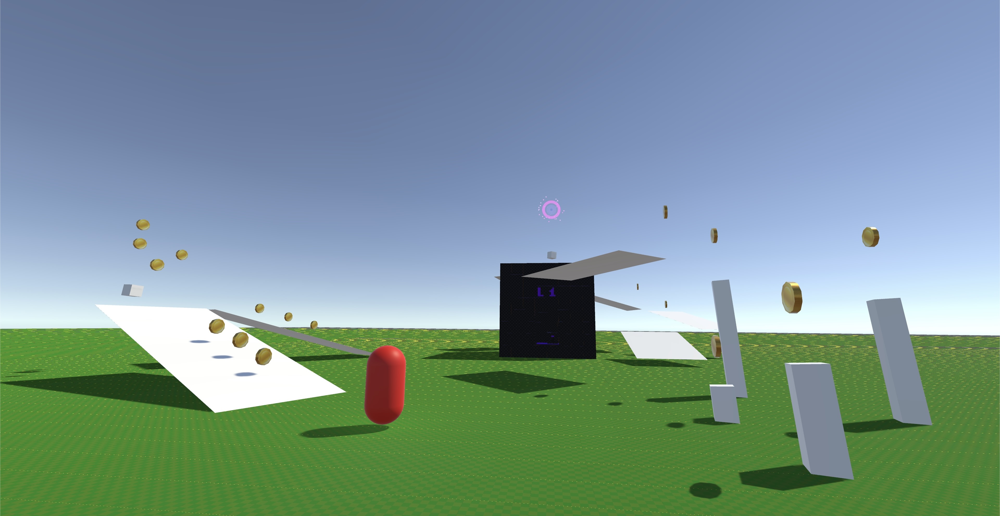
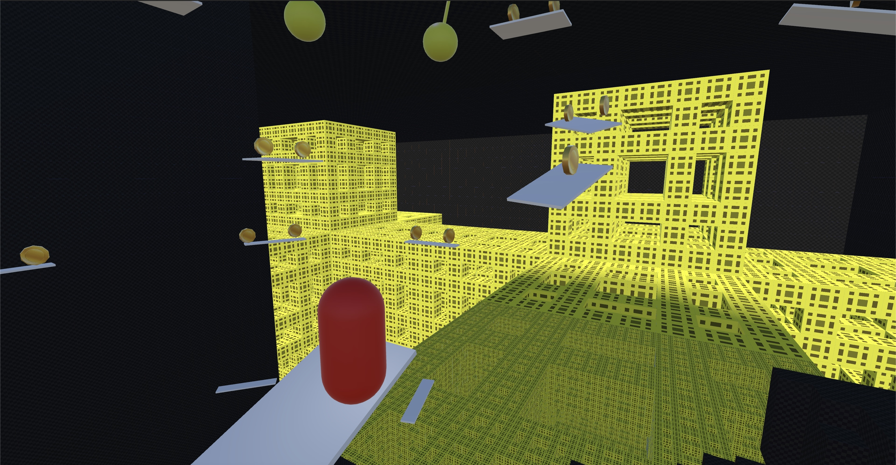
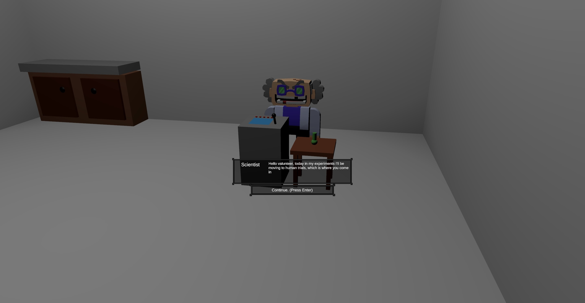

# 2024fa-475-DryBones

## Mr. Pillman and the Scientist's Big Shrink
A capsule collider discovers that the world is much larger than it seems.

## Screenshots

## Run the game
- Windows: run ``My project.exe``
- MacOS: run ``My project.app``

(see releases section)

## Gameplay
### Basic Controls
- Move: ``WASD`` OR ``ARROW KEYS``
- Jump: ``SPACE``
- Shrink: ``SCROLL UP`` OR ``G``
- Grow: ``SCROLL DOWN`` OR ``H``
- Change Perspective: ``C``
### Upgrade Controls
- Sprint: ``SHIFT``
- Double Jump: ``SPACE`` × 2
- Dash: ``LEFT MOUSE BUTTON``

## Authors
- Quang
- Lincoln Craddock
- Josh
